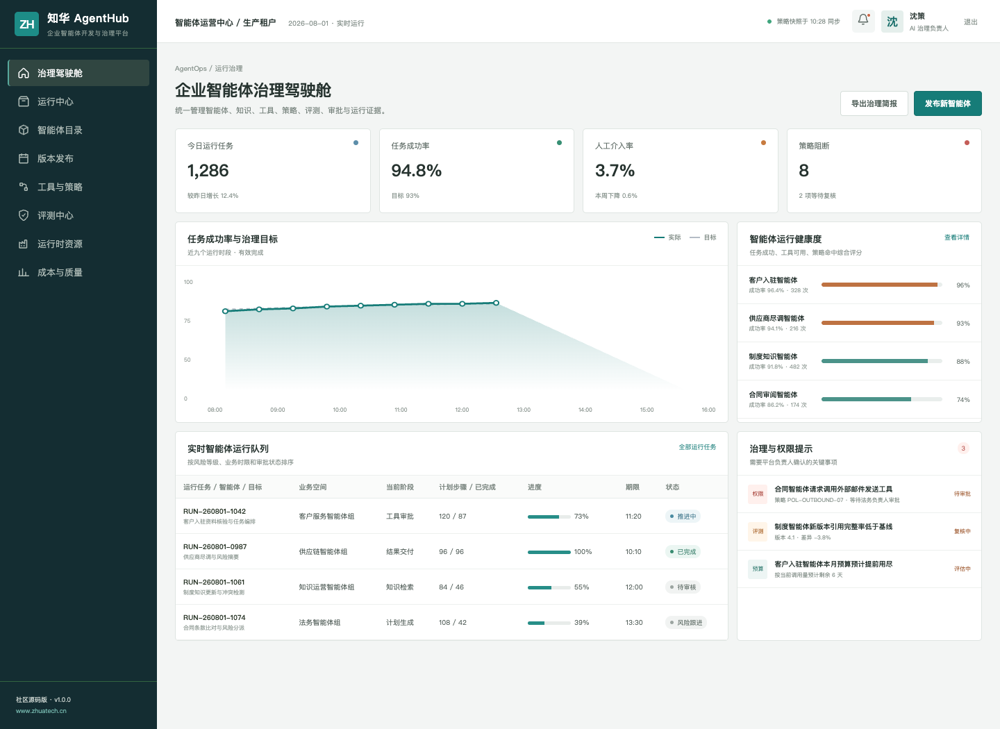
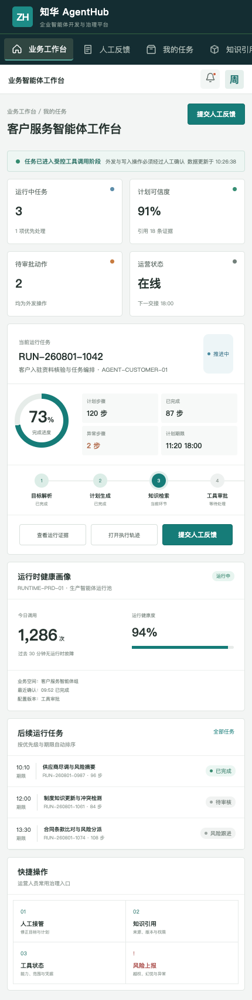

# ZhuaTech AgentHub｜知华科技企业智能体开发与治理平台

ZhuaTech AgentHub 是面向企业 AI 团队与业务运营团队的 AgentOps 社区源码项目：把智能体目录、运行时、知识、工具、评测、审批、成本和审计证据统一到一个可治理的平台中。

[知华科技官网](https://www.zhuatech.cn/) · [架构设计](docs/architecture.md) · [API 摘要](docs/api.md) · [部署说明](deploy/README.md)



## 一条可控的智能体运行链

```text
业务目标 → 计划生成 → 知识引用 → 工具调用 → 人工审批 → 结果交付 → 评测归档
```

- 智能体目录、版本发布与业务负责人
- 多步骤任务、执行轨迹、人工接管与重试
- 工具权限、参数范围、敏感动作审批与预算
- 离线评测、线上采样、红队测试与质量基线
- 运行成功率、延迟、人工介入率与成本分析
- 可插拔 `AgentRuntime`；社区演示执行器不调用外部模型



## 技术基线

| 层级 | 方案 |
| --- | --- |
| Web | Vue 3、Pinia、Vue Router、Axios、Vite，响应式 H5 |
| API | Java 21、Spring Boot、Spring Security、JWT、JPA、Flyway |
| 数据 | MySQL 8；测试使用 H2 |
| Java 包 | `cn.zhuatech.agenthub` |
| 演示账号 | 管理端 `planner / Demo@2026`；业务端 `operator / Demo@2026` |

前端演示：`cd frontend && npm install && npm run dev:demo`，访问 `http://localhost:5173`。完整环境：复制 `.env.example` 为 `.env` 后执行 `docker compose up --build`。

## 使用许可与服务

本工程仅限个人学习、研究和非商业技术交流，**不得商用**。企业内部部署、生产使用、SaaS、项目交付、收费培训、品牌替换或商业再分发，均须事先获得上海如静知华信息科技有限公司书面授权，详见 [LICENSE](LICENSE)。

深度开发、私有化部署、智能体/模型接入及商业授权，请访问[知华科技官网](https://www.zhuatech.cn/)或扫码咨询。

| 微信咨询一 | 微信咨询二 |
| --- | --- |
|  |  |

SEO：Agent 平台源码、AgentOps、企业智能体治理、AI Agent 开源、智能体评测、Java Agent、Vue Agent 平台、知华科技。
